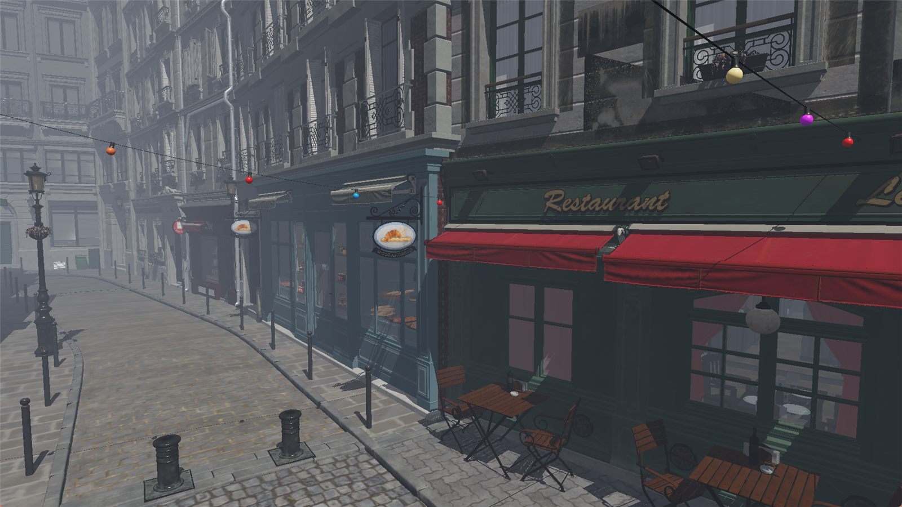
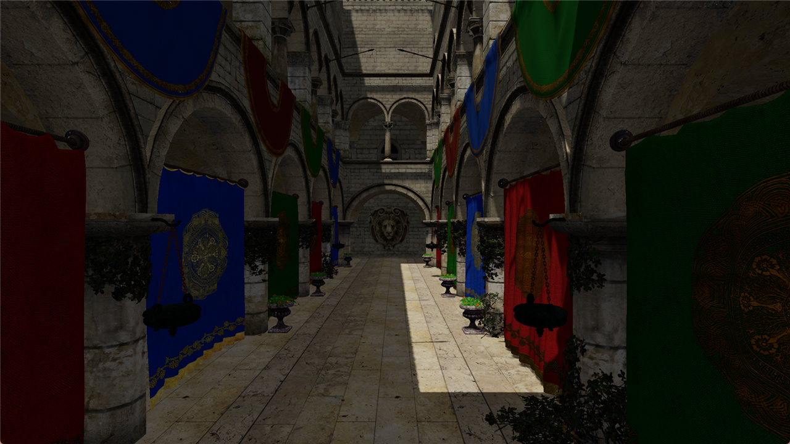
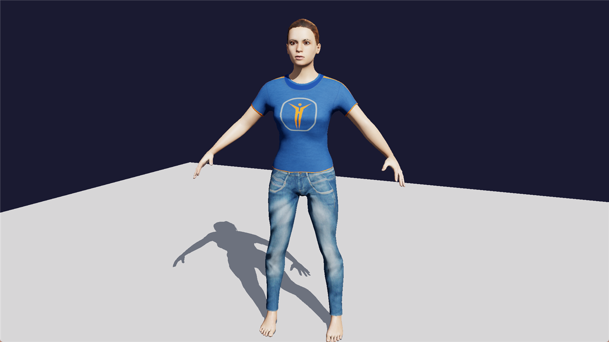
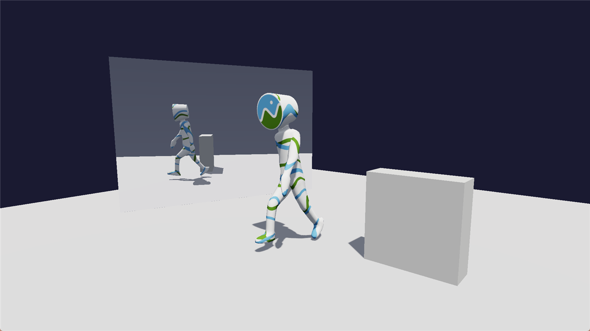

# Renderer

A modular real-time renderer for Windows, written in C++20. It draws scenes described in
a small XML format, loads glTF 2.0 models, and runs on either Vulkan 1.3 or Direct3D 12
from the same code and the same HLSL shaders.



*Amazon Lumberyard Bistro, fully ray traced: primary rays, shadows and reflections, with
volumetric fog carved by the sun. `viewer --rtprimary --rt --reflections traced bistro_fog.xml`*

What it does:

- GPU-driven drawing: one indirect draw stream, culling, level of detail and occlusion
  decided on the GPU, command buffers recorded once and reused.
- Physically based shading with cascaded shadow maps, point lights, reflection probes,
  fog, a procedural sky, and ray-traced primary visibility, shadows and reflections
  where the hardware offers ray queries.
- Skinned animation with clip blending, straight from glTF.
- A borderless or per-pixel transparent window, for overlays and launcher-style apps.
- An optional embedded Python host, so a scene can carry scripts that spawn models,
  move the camera, change the lighting and switch animations while it runs.

The engine ships as one DLL, `rend.dll`. The repository also builds `viewer.exe`, a
scene viewer that is both the demo and the test bed, and `rend_assetio.dll`, which reads
scene and model files so the engine itself never touches a file format.

## What you need

- Windows 10 or 11, 64-bit, with a GPU and driver that support Vulkan 1.3 or
  Direct3D 12. Ray tracing features switch on only where the hardware has them.
- [Visual Studio 2022](https://visualstudio.microsoft.com/) with the "Desktop
  development with C++" workload.
- [CMake](https://cmake.org/download/) 3.24 or newer.
- The [Vulkan SDK](https://vulkan.lunarg.com/sdk/home). The build uses its shader
  compiler, `dxc`, to compile every shader ahead of time.

Everything else is fetched by CMake on the first configure: SDL3, volk, Dear ImGui,
cgltf, pugixml, stb, meshoptimizer, pybind11 and a pinned CPython. There is nothing to
install by hand and no system Python is needed.

## Building

```
git clone https://github.com/0xen/Renderer.git
cd Renderer
cmake -S . -B build -G "Visual Studio 17 2022" -A x64
cmake --build build --config Release
```

The first configure downloads the dependencies, so it takes a few minutes. The result
is `build\bin\Release\viewer.exe` next to `rend.dll`, `rend_assetio.dll`,
`rend_pyhost.dll` and a `data\shaders\` folder holding the compiled shaders.

Options you can pass to the configure step:

| Option | Default | What it does |
|---|---|---|
| `-DREND_BUILD_APPS=OFF` | ON | Build only `rend.dll` and the shader rule, for a project that consumes the engine |
| `-DREND_PYTHON=OFF` | ON | Skip the Python host and the CPython download |
| `-DREND_DXIL=OFF` | ON | Compile shaders to SPIR-V only, dropping the Direct3D 12 backend's DXIL |
| `-DREND_TRACY=ON` | OFF | Build with the Tracy profiler client |

## Your first scene

The viewer takes a scene file. Scenes live in their own folders, anywhere on disk, and
this repository ships none, so the first step is to make one.

**1. Get a model.** Any glTF 2.0 model works. The Khronos
[glTF Sample Assets](https://github.com/KhronosGroup/glTF-Sample-Assets) are a good
start; most are CC0 or CC-BY, and each one's `README.md` states its licence. Use the
`.gltf` form with a separate `.bin` and image files, not a single `.glb`, since the
importer loads textures by file path. For this example, take `FlightHelmet`.

**2. Lay the folder out** like this, with the model in its own subfolder:

```
my_scene\
  my_scene.xml
  model\
    FlightHelmet\
      FlightHelmet.gltf
      FlightHelmet.bin
      ... its texture files
```

**3. Write `my_scene.xml`.** Mesh paths are relative to the scene file. A camera, a
sun that casts shadows, and one model on the ground:

```xml
<Scene name="my_scene">
    <Camera position="1.2 0.9 1.6" target="0 0.45 0" fovDegrees="45" />
    <Light type="directional" direction="-0.5 -1.0 -0.3" color="1.0 0.96 0.9"
           intensity="1.4" castsShadows="true" />
    <Model name="helmet">
        <Mesh path="model/FlightHelmet/FlightHelmet.gltf" />
        <Transform position="0 0 0" rotation="0 30 0" scale="1 1 1" />
    </Model>
</Scene>
```

**4. Run it.**

```
build\bin\Release\viewer.exe C:\path\to\my_scene\my_scene.xml
```

A window opens on the scene. Hold the right mouse button and move the mouse to look
around, and use W A S D to fly, with E and Q for up and down and Shift to go faster.
Press G to switch to walking, with gravity and a body that stops at walls, and G again to
fly. Esc quits.

From here, `docs/SCENE_FORMAT.md` is the reference for everything a scene file can
say: point lights, reflection probes, fog, animated models and their clips, streaming
versus wait-for-everything loading, and scripts.

## The viewer

```
viewer [options] <scene.xml>
```

| Option | What it does |
|---|---|
| `--backend vulkan` or `--backend d3d12` | Choose the graphics API. Vulkan is the default |
| `--rt` | Ray-traced shadows instead of cascaded shadow maps |
| `--rtprimary` | Ray-traced primary visibility instead of rasterising |
| `--reflections probe` or `--reflections traced` | Reflection technique for surfaces marked `reflective` |
| `--aa off` or `--aa fxaa` | Anti-aliasing at startup |
| `--transparent` | A borderless window with per-pixel alpha, drawn over the desktop. Uses Direct3D 12 unless told otherwise |
| `--walk` | Start in walking mode |
| `--script <file.py>` | Run a Python script alongside the scene; repeatable, and these run before the scene's own |
| `--novsync` | Present as fast as possible |
| `--bench N` | Exit after N frames with a timing report |
| `--debug` | Mirror the log to `viewer.log` beside the executable and turn on synchronisation validation |
| `--noui` | No overlay panels, for captures and demos |
| `--size WxH` | Initial window size, for example `--size 1920x1080` |
| `--nocull`, `--nolod`, `--noocclusion`, `--noobb` | Switch off one stage of the GPU culling pipeline, for comparison |

While it runs, the number keys 1 to 9 switch every animated model to one of its first
nine clips, and Space toggles between the once-recorded command buffers and recording
every frame. An in-window panel shows the frame timing and lets you change the same
graphics settings a script can.

## Scripting

A scene can list Python scripts, and they run inside the viewer against a `rend` module
that loads and moves models, drives the camera, changes the sun, sky and point lights,
switches animation clips and reads or sets the graphics settings. `docs/SCRIPTING.md` is
the reference, with a complete example. Scenes without scripts never load the Python
host at all.

## More scenes

| | |
|---|---|
|  |  |
| Crytek Sponza, rasterised with cascaded shadow maps and the sun through the atrium. | A skinned glTF character with ray-traced shadows, `viewer --rt`. |
|  | |
| A walking clip from glTF, with a `reflective` surface showing the probe reflection. | |

Every one of these is a folder of glTF files and one XML scene, run with the same
`viewer.exe`. The models are the Khronos and Amazon Lumberyard sample assets under their
own licences.

## Using the engine in your own project

Add this repository as a subdirectory with the apps switched off, link `rend::engine`,
and use the same shader rule the engine uses for its own HLSL:

```cmake
set(REND_BUILD_APPS OFF)
add_subdirectory(Renderer)
target_link_libraries(my_app PRIVATE rend::engine)
rend_add_shaders(my_shaders SOURCE_DIR shaders OUTPUT_DIR ${CMAKE_BINARY_DIR}/bin/$<CONFIG>/data/shaders
                 STAGES "my.hlsl|VSMain|vs_6_0|my.vert.spv" "my.hlsl|PSMain|ps_6_0|my.frag.spv")
```

`docs/ARCHITECTURE.md` describes the layers, the backend-neutral GPU interface, the
GPU-driven rendering model and how intent in a scene maps to a technique in the renderer.

## Licence

This repository is published to show the work. It is under the
[PolyForm Strict License 1.0.0](LICENSE): you are welcome to read the code and build
and run it for noncommercial purposes, but not to distribute it, modify it or build
products on it. Pull requests are not being taken.

The dependencies CMake fetches carry their own licences: SDL3 (zlib), volk (MIT), Dear
ImGui (MIT), cgltf (MIT), pugixml (MIT), stb (public domain or MIT), meshoptimizer
(MIT), pybind11 (BSD-3) and CPython (PSF). Models you use in scenes carry the licence
of their source, so keep a note of where each one came from.
